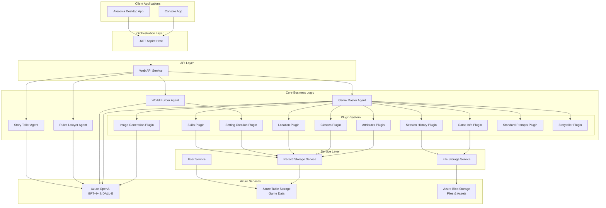

# Digital Dungeon Master

This is an AI Orchestration experiment to use AI to moderate a solo adventure game similar to Dungeons & Dragons.

The AI's role is to generate the story, the player's role is to make decisions and roll dice, carry out encounters, and correct the game master if it gets off track or goes down an unwanted direction.

The application supports multiple client interfaces including console and desktop applications, all backed by a comprehensive API and AI agent system.

## Architecture Overview

Digital Dungeon Master is built using a modular, multi-tier architecture leveraging .NET 9.0 and Microsoft Semantic Kernel for AI orchestration. The system consists of multiple specialized AI agents working together to create an immersive D&D-like experience.



### Key Architectural Components

- **Client Applications**: Multiple frontend options including console and desktop applications
- **API Layer**: RESTful Web API service providing all game functionality
- **AI Agents**: Specialized agents for different aspects of game management
- **Plugin System**: Modular, extensible plugin architecture for game capabilities
- **Service Layer**: Abstracted services for data persistence and external integrations
- **Azure Integration**: Cloud-native services for AI, storage, and scalability

## Azure Setup Requirements

Digital Dungeon Master requires several Azure services to function properly. This section provides an overview of the requirements. For detailed setup instructions, see the [Azure Setup Guide](docs/azure-setup.md).

### Required Azure Services

1. **Azure OpenAI Service**
   - Deploy a GPT-4 or later model (GPT-3.5-Turbo is not supported due to tooling requirements)
   - Deploy a DALL-E model for image generation (optional but recommended)
   - Deploy an embedding model for vector operations (if using embeddings)

2. **Azure Storage Account**
   - Create a storage account with:
     - **Table Storage**: For game data, user information, rulesets, and configuration
     - **Blob Storage**: For file storage, game assets, and generated content

### Quick Configuration

Create a `secrets.json` file (using `dotnet user-secrets`) or configure `appsettings.json` with:

```json
{
  "AzureResources": {
    "AzureOpenAiKey": "your-azure-openai-key",
    "AzureOpenAiEndpoint": "https://your-resource.openai.azure.com/",
    "AzureOpenAiChatDeploymentName": "your-gpt4-deployment-name",
    "AzureOpenAiImageDeploymentName": "your-dalle-deployment-name", 
    "AzureOpenAiEmbeddingDeploymentName": "your-embedding-deployment-name",
    "AzureStorageConnectionString": "your-storage-connection-string"
  }
}
```

**Security Note**: Always use user secrets or environment variables for production deployments. Never commit credentials to source control.

➡️ **For complete Azure setup instructions, see [docs/azure-setup.md](docs/azure-setup.md)**

## Local Development Setup

This section provides a quick start for development. For comprehensive setup instructions, see the [Development Setup Guide](docs/development-setup.md).

### Prerequisites

- .NET 9.0 SDK
- Visual Studio 2022 or VS Code with C# extension
- Azure subscription with the services mentioned above

### Quick Start

1. **Clone the repository**
   ```bash
   git clone https://github.com/IntegerMan/DigitalDungeonMaster.git
   cd DigitalDungeonMaster
   ```

2. **Configure user secrets** (see Azure setup section above)

3. **Build and run**
   ```bash
   dotnet build
   dotnet run --project MattEland.DigitalDungeonMaster.AspireHost
   ```

This will start the orchestrated environment with the Web API and your choice of client application.

➡️ **For detailed development setup, debugging, and contribution guidelines, see [docs/development-setup.md](docs/development-setup.md)**

## AI Agents and Capabilities

Digital Dungeon Master employs a multi-agent AI architecture where specialized agents handle different aspects of the game experience.

### AI Agents

1. **Game Master Agent** (`GameMasterAgent`)
   - Primary orchestrator of the game experience
   - Manages turn-by-turn gameplay and player interactions
   - Coordinates with other agents and plugins to provide comprehensive responses

2. **World Builder Agent** (`WorldBuilderAgent`)
   - Responsible for creating and managing game worlds and settings
   - Generates locations, NPCs, and environmental details
   - Maintains world consistency and lore

3. **Rules Lawyer Agent** (`RulesLawyerAgent`)
   - Enforces game rules and mechanics
   - Handles dice rolls, skill checks, and combat resolution
   - Ensures game balance and rule compliance

4. **Story Teller Agent** (`StoryTellerAgent`)
   - Focuses on narrative generation and storytelling
   - Creates engaging story arcs and character development
   - Maintains narrative consistency and pacing

### Plugin System

The system uses a modular plugin architecture with the following capabilities:

#### Game Master Plugins

| Plugin | Description | Key Functions |
|--------|-------------|---------------|
| **Attributes Plugin** | Manages character attributes and stats | `GetAttributes()` - Retrieves available attributes for the current ruleset |
| **Classes Plugin** | Handles character classes and their features | Character class information and abilities |
| **Game Info Plugin** | Provides current game state information | `GetPlayerCharacters()` - Returns player character details |
| **Image Generation Plugin** | Generates AI images using DALL-E | `GenerateImageAsync()` - Creates images from text descriptions |
| **Location Plugin** | Manages game locations and environments | Location data and environmental details |
| **Session History Plugin** | Tracks game session progress | Maintains session state and history |
| **Skills Plugin** | Handles character skills and skill checks | Available skills and their applications |
| **Standard Prompts Plugin** | Provides common game prompts and responses | Standardized game interactions |
| **Storyteller Plugin** | Narrative generation and story management | Story creation and progression |

#### World Builder Plugins

| Plugin | Description | Key Functions |
|--------|-------------|---------------|
| **Setting Creation Plugin** | Creates game worlds and campaign settings | World generation and setting details |

### Technology Stack

- **AI Framework**: Microsoft Semantic Kernel 1.30.0
- **AI Models**: Azure OpenAI GPT-4+ (required), DALL-E for image generation
- **Backend**: .NET 9.0, ASP.NET Core Web API
- **Orchestration**: .NET Aspire for service discovery and monitoring
- **Data Storage**: Azure Table Storage, Azure Blob Storage
- **Client Frameworks**: Console (terminal-based), Avalonia (cross-platform desktop)
- **Architecture Patterns**: Clean Architecture, Plugin Architecture, Multi-Agent Systems

### Integration Points

- **Azure OpenAI**: All AI agents integrate with Azure OpenAI for natural language processing
- **Azure Storage**: Persistent storage for game data, user information, and generated content
- **Semantic Kernel**: Provides the AI orchestration layer and plugin system
- **Aspire**: Handles service discovery, monitoring, and distributed tracing

➡️ **For detailed plugin documentation and development guidelines, see [docs/plugins.md](docs/plugins.md)**

## Contributing

This project is actively being developed. The current focus areas include:

- Expanding the plugin system with additional game mechanics
- Improving the user interface options
- Enhancing the AI agent coordination
- Adding support for additional game rulesets
- Improving Azure deployment automation

## License

*License information to be added*
